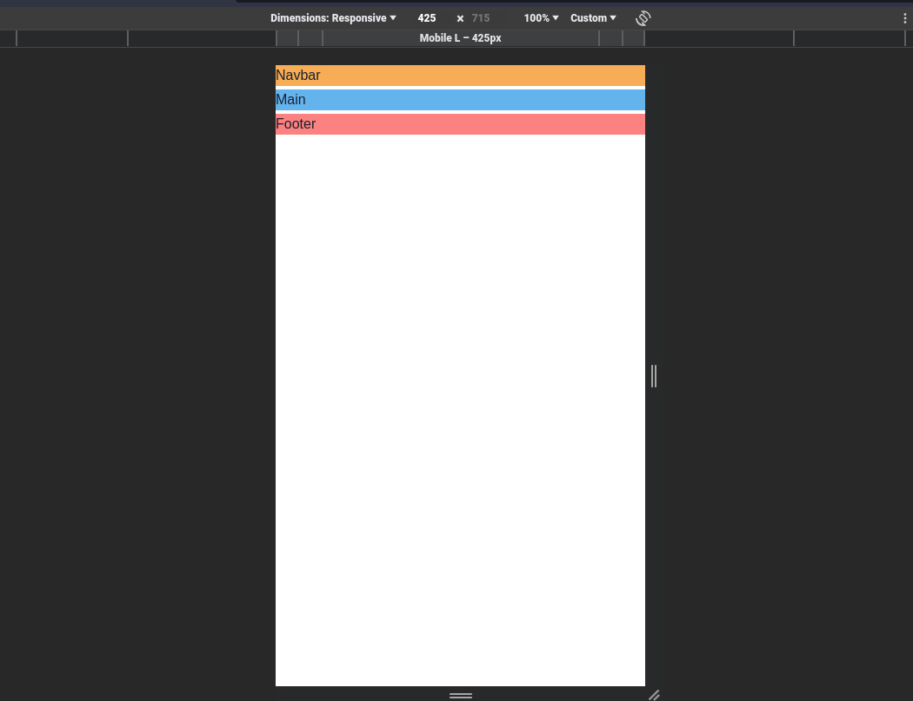
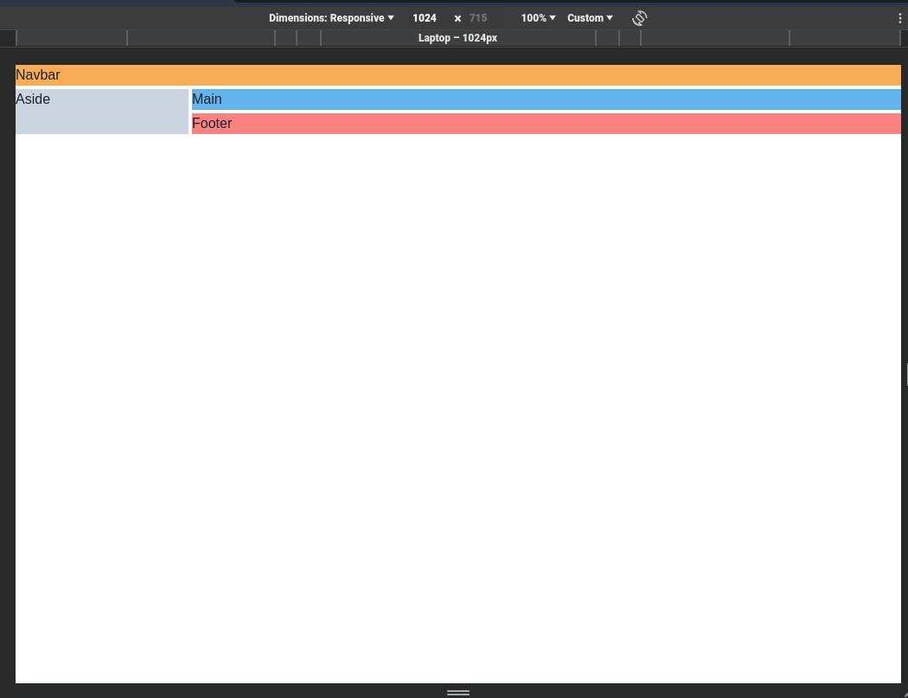
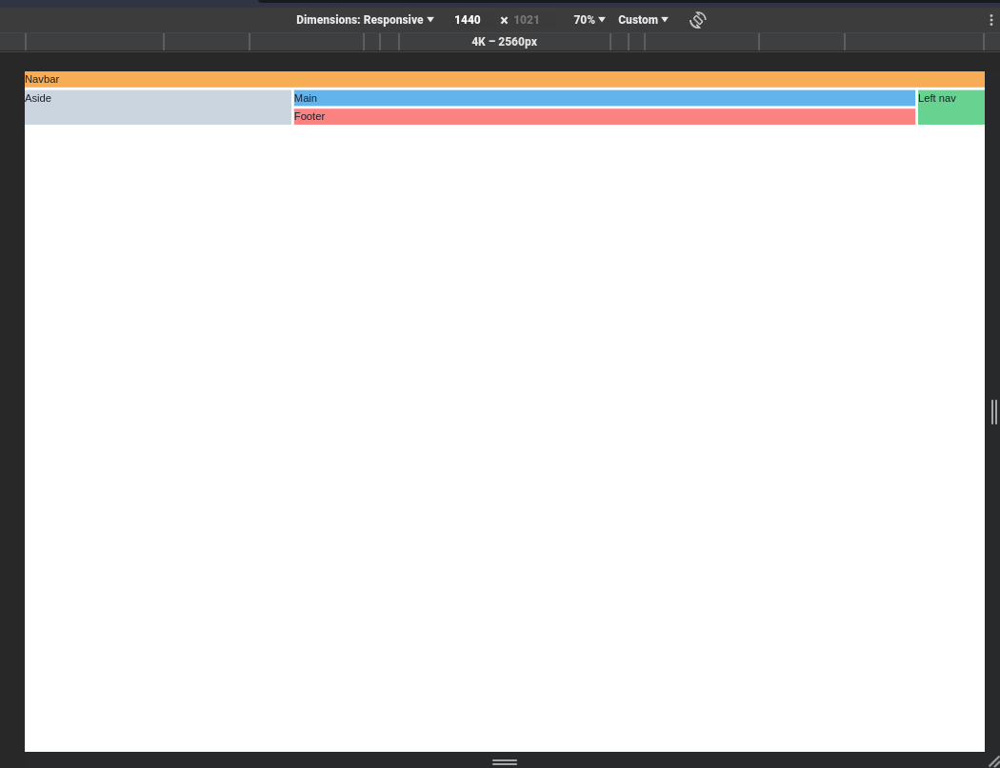

# Hands on Chakra-UI Grid System

Hands on [chakra](https://chakra-ui.com/) UI library by building simple layout responsive grid system.

## Page structure

- sm screen (one column): header, main, and footer
- md screen (two columns): header(one row), aside(200px), main(1fr)
- xl screen (three columns): header(one row), aside(400px), main(1fr), and right nav(100px)

## Screenshots

- Mobile
  

- Laptop/big tablets
  

- Very Large Screens
  
